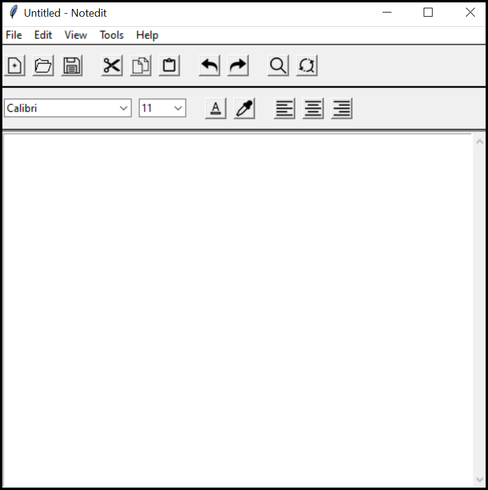

# Notedit
Python project which uses the modules tkinter, PIL and os.

It performs all the basic functions of a text editor.

- Create a new text file.
- Open an existing text file.
- Saving a new file.
- Saving an existing file.
- Renaming a file.
- Cut text.
- Copy text.
- Paste text.
- Undo operation.
- Redo operation.
- Changing font family.
- Changing font size.
- Changing text color.
- Changing background color.
- Align the text to left.
- Align the text to center.
- Align the text to right.
- Finding all occurrences of required text.
- Replacing all occurrences of text with other desired text. 

The application supports shortcut keys for all the common operations. A list of supported shortcut keys can be viewed using the ‘Shortcuts’ command in help menu. 

